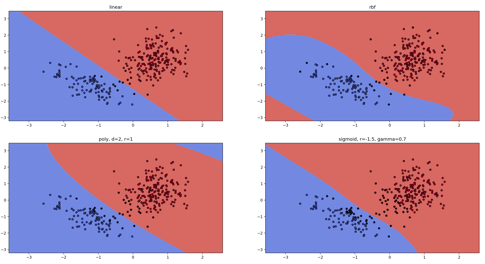
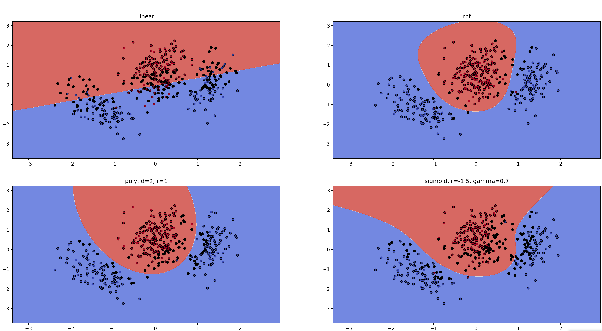
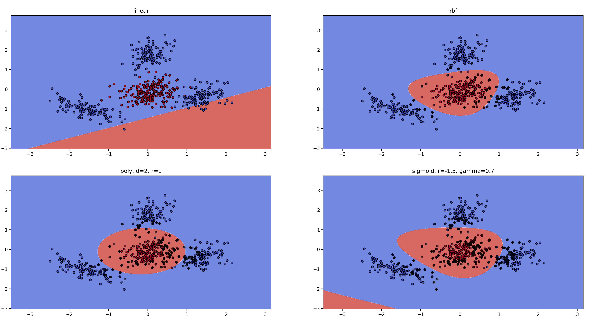

# Support Vector Machines - Toy Examples
A basic script using skikit learn to play around with support vector machines. 

## On Support Vectors 
In its basic formulation, a support vector machine is a maximum-margin classifier which tries to find a (linear) hyperplane seperating the samples form two classes. In a two-dimensional space, that would be a line, in a three dimensional space, that would be a plane, and so on. The SVM tries to fit the hyperplane such that the margin (distance) between it and the sample points is maximized. 

Samples defining the hyperplane are called support vectors. If those samples would be removed from the set, the seperating hyperplane would change. All other samples (non-support vectors) could be removed from the set of points without affecting the hyperplane. 

In the below figures, the respective support vectors are indicated by a cross.

## On Kernels
Usually, features in low-dimensional spaces are not linear seperable, so a classical SVM would fail to find a good decision boundary. 

Non-linear kernels project the features into a higher (possibly infinite) feature space to improve seperability of the data. Luckly, doing this explicitly (e.g. by actually calculating the projected higher-dimensional feature representation) is not necessary. During derivation of the SVM optimization problem one only needs the scalar product between sample vectors. So it is sufficient to provide a function $K(x,y)$ (the Kernel) which directly calculates said scalar product rather. With higher dimensionality of the feature space chances rise that the features will become linear seperable. So, in short, the "Kernel Trick" allows to find a linear seperation of low-dimensional samples in a high-dimensional (virtual) feature space without explicitly projecting the features into that feature space. 

## Kernel functions
There are various kernels used in literature even though the most widely used one if the RBF Kernel (Radar Basis Function). 

$$K(x,y) = \exp(\gamma||x-y||^2)$$

Its corresponding feature space has infinite many dimensions, so samples will always be seperable. This does not necessary lead to a good generalization, so careful tuning of the SVM parameters is still needed to achieve good results. 

The polynomial kernel 

$$K(x,y) = (x^Ty+r)^d$$

represents a feature space defined by polynomials of the original samples (e.g. squared terms $x_1^2$ and cross-product $x_1\cdot x_2$).

Another frequently used kernel is the sigmoid kernel defined as

$$K(x,y) = \tanh(\gamma\cdot x^T y+r)$$

which resembles a certain similarity to the sigmoid activation function used in some neural networks. 

## Toy Example 1
If data is (almost) linear seperable, a linear SVM is preferable due to its superior training time and super fast inference (prediction). 

## Toy Example 2
If data becomes non-seperable, the linear SVM fails to classify the data correctly. The improved expressivness of non-linear kernels can help to maintain a good classification, though

## Toy Example 3
Non-linear kernels are expressive enough to cover even more complicated cases like the below (NOTE: The linear SVM fails completely)

## Toy Example 4
With completely seperated clusters, the high expressivness of the infinite dimensional vector space of the RBF kernel really shines. 

